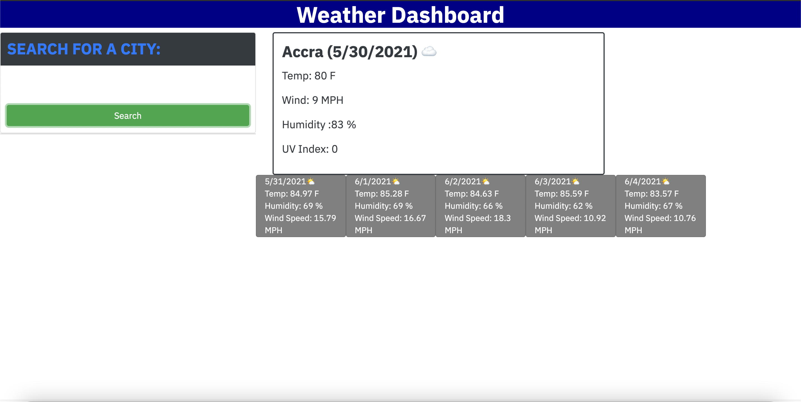

# Weather Dashboard
Create a weather dashboard that shows the weather outlook for multiple cities.

## Purpose
* Create a weather dashboard that: 
   * Shows a form input for a city to be searched.
   * Presents the current and future condition that city and added to search history.
   * Presents the city's name, the date, temperrature, huimidity, wind speed and uv iindex.
   * Presents a five day forcast of the city with it's dates.
    
## Built with 
* HTML
* JAVASCRIPT
* CSS
* BOOTSTRAP
* MOMENT.JS
* SERVER SIDE APIS

## Website
https://maa-hub.github.io/weatherDashboard/

## Contribution
Made with ❤️ by Maame

